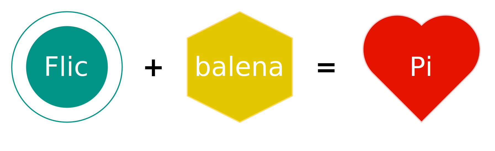

<h1 align="center">
  <a name="top">🔘</a><br/>Flic smart button bridge<br/> <sup><sub>a <a href="https://balena.io">balena</a> and Docker container 🐳</sub></sup>
</h1>

[![Price][img-price]][link-license]
[![License][img-license]][link-license]
[![GitHub Release][img-release]][link-release]
[![Flic SDK Version][img-flic-sdk]][link-flic-sdk]
[![Docker][img-docker-hub]][link-docker-hub]
[![Travis CI][img-travis]][link-travis]
[![balena.io][img-balena]][link-balena]
[![PRs Welcome][img-prs]][link-prs]
[![Tweet][img-twitter]][link-twitter]

Turn a [Raspberry Pi](https://www.raspberrypi.org/) or many single-board computers into a plug-in appliance to bridge your Bluetooth [Flic smart buttons](https://flic.io/) to your home automation system of choice, like [Home Assistant](https://www.home-assistant.io/).

Useful if your Flic buttons are located too far from your home automation hub, or if you need to use your hub's bluetooth antenna for something else.

- [balena Dockerfile](#balena-) for ARM architecture based on [Alpine Linux](https://alpinelinux.org/about/) that weighs less than 40 MiB on a Raspberry Pi. ⚖️
- [Regular Dockerfiles](#docker-) are available for traditional Docker stacks. 🐳
- Pre-built Docker images with multi-platform support [are automatically kept updated on Docker Hub](https://hub.docker.com/r/renemarc/balena-flic): ARM ones are Alpine-based while x86 ones are using Debian.

<div align="center">
    <figure>
        <div>
            <a href="https://www.draw.io/?title=flic%2Bbalena%3Dlove.xml#R7VdNb%2BIwEP01OS7KJ4FjgdIethJSV9qzSUxi1Ykjx1Dor99xPAkJDm0P0NPmAPGzZ2y%2FeTOxnWBZHJ8kqfIXkVLu%2BG56dIKV4%2FtxOINfDZwMEHqxATLJUgN5Z%2BCVfVAEXUT3LKX1YKASgitWDcFElCVNlMHQlkgp3usBtBN8OGtFMmoBrwnhNvqXpSpH1HPdc8czZVmOU88i7NiS5C2TYl%2FifKUoqekpSOsGh9Y5ScV7DwoenWAphVDmrTguKdestowZu%2FWV3m7JkpbqOwbB1FgcCN%2FjtjcMl6ZOLRMHKhUDYn6TLeUbUTPFRAldBUtTPWZBOMs0kMC0VALA9chFx8NScAHwqmEiWLT%2BHtCs81MrKd46tv0Oae0dP1ivl%2FBAz45x3sNp5IUQGbBoKdWNlNQ5TbEBPZXeUXHMtGAnTNTxhIF86klOiQTCFs1qO4NEFCzB950o1ZoUjGs1L5sO330lZQ1%2FL6%2BOv4T%2FB8kIN6%2FPlB%2Bo3qRp1jDwV00l26ErlDvkiGn3drJrHs1qXRld79hRr8mw2uO%2Fo7uuSMLK7I%2BoAP3l6fXaSkBxaPLpsQehMp6oKKiSJxjSZnAUGBNM4MCPTPv9nA6Q1hMfEz3vJYPfZgnBLMw692c5wgsq8oo6Y0udjr%2Bw5AnbaWJHa%2FZBtg2qGSB7BVQ1NHtjGr2qwkqwUjXLjhZOtLrQGmp4KEwEh%2FK5tWRwx96IhO4jgGDqDgQQtqW5J4DQtYMf3CL2Myv2a64ZvAj%2BIMOvJogV%2FMtakBUpn0iSMrHdK6WN7dLjuvNoFtulp8Pt8mWl8Jel9Koqv6ga6%2Ba5reoGpfQ%2BEvP8b9QYd0Rjtykwc7vAYJn5X2B%2BoMBM42H0f7LAhJ4V%2By2c%2FUpihb%2BtFTk9kqwpDRWwBhPqKLfopoX8%2Bx4WpFAEa8bcHTkGBcnMHIPsg9NqPp1%2BesYZ5Pu1Uwkq3p1AiY5iL%2FTN7zzUvnMh2QcYws7QpX2iu4uSwvYk29aRwFbSaB3x5rfQUjRyULlQES3TB30rOSfzFyr5vOSPVonmY6Qf6ClF843BfBaadXXCqFwlnKaDO5FNd4%2FOaITNFpOUg0oPw5vUGMM4w0ZXxOtfhSiaDl3UYi8Tilb9%2B82Fo3kcXziKho4UkRlVlqMm4N22xzQAzfM1zQw%2F34KDx38%3D" title="The Love Pi equation.">
            </a>
        </div>
        <figcaption>
            <p><strong>The Love Pi equation.</strong></p>
        </figcaption>
    </figure>
</div>

**[Why use the balena ecosystem?](https://www.balena.io/what-is-balena)** All the goodness of [Docker](https://www.docker.com/why-docker), plus security handling, IoT hardware optimized images, read-only rootFS, a build pipeline, a device management interface, and continuous deployment, _for free_ (well, first 10 devices on balenaCloud …or unlimited if you [run your own OpenBalena platform](https://github.com/balena-io/open-balena)).

Of course you _could_ do all of this on your own, but do you _really_ want to micro-manage, keep secure, always perform clean shutdowns, and generally baby something that should really be just plug-in, set-and-forget hardware? 🤔 I surely don't! 😅

<p align="right"><a href="#top" title="Back to top">🔝</a></p>

## Table of contents 📑

1. [Prerequisites](#prerequisites-)
2. [balena](#balena-)
    1. [Preparation](#preparation-)
    2. [Installation](#installation-)
    3. [Pairing](#pairing-)
    4. [Unpairing](#unpairing-)
3. [Docker](#docker-)
    1. [Hub images](#hub-images-)
    2. [Build and run](#build-and-run-)
4. [Alternatives](#alternatives-)
5. [Contributing](#contributing-)
6. [Thanks](#thanks-)

<p align="right"><a href="#top" title="Back to top">🔝</a></p>

## Prerequisites ✅

1. At least one [Flic smart button](https://flic.io/).
2. Your favourite [Internet of Things](https://en.wikipedia.org/wiki/Internet_of_things) (IoT) device that offers both Bluetooth Low Energy (BLE) and network access, like the inexpensive [Raspberry Pi Zero W](https://www.raspberrypi.org/products/raspberry-pi-zero-w/).
3. Working access to an MQTT broker, either [a public one](https://github.com/mqtt/mqtt.github.io/wiki/public_brokers), your own hosted [Mosquitto](https://mosquitto.org/) instance or [the Home Assistant addon](https://www.home-assistant.io/addons/mosquitto/).
4. (Recommended) [A free-tier account](https://dashboard.balena-cloud.com/signup) on [balenaCloud](https://balena-cloud.com/) along with [a properly set SSH public key](https://www.balena.io/docs/learn/getting-started/raspberrypi3/nodejs/#adding-an-ssh-key) into your account.
5. (Recommended) [The balena command-line tools](https://www.balena.io/docs/reference/cli/). Do read up on their [friendly development guidelines](https://www.balena.io/docs/learn/develop/local-mode/).

Let's play! 🤠

<p align="right"><a href="#top" title="Back to top">🔝</a></p>

## balena 📦

Follow these simple steps to quickly get your app running on a dedicated device using balenaCloud. If you want more control, [try the Docker solution instead](#docker-).

For reference, the balena framework will build the container using the [`./Dockerfile.template`](../Dockerfile.template) which employs placeholders so that the correct system architecture is picked for you during installation. Easy! 😃

### Preparation 🍔

1. [Create a new application](https://dashboard.balena-cloud.com/) on balenaCloud dashboard and select the appropriate IoT hardware.
2. Add a new device to your app. Start with _development mode_ for local testing, or go directly for _production mode_ if you know what you're doing.
3. (Optionally) Configure the downloaded image to give your device a custom hostname instead of the generic **balena**:

   ```shell
   sudo balena local configure /path/to/downloaded/image.img
   ```

4. [Burn the image](https://www.balena.io/etcher/) to a disk and boot your IoT device.

Your hardware is ready; it's now time to [install the project! ⬇️](@installation)

<p align="right"><a href="#top" title="Back to top">🔝</a></p>

### Installation 💻

1. Git clone this project's repository:

   ```shell
   git clone git@github.com:renemarc/balena-flic.git
   ```

2. Add your balena application as a secondary remote to the cloned repo:

   ```shell
   git remote add balena <username>@git.balena-cloud.com:<username>/<appname>.git
   ```

3. Push the code to balenaCloud and wait for it to build and provision your device:

   ```shell
   git push balena master
   ```

Great! You are now ready to [pair your button. ⬇️](#pairing-)

<p align="right"><a href="#top" title="Back to top">🔝</a></p>

### Pairing 💑

Since only one controller can be paired at a time, do make sure that your Flic button is unpaired from your mobile device by using the Flic mobile app to remove the button from its interface.

#### The easy way: Automatic pairing 🤖

Configure your Home Assistant (or other automation system) by pointing it to your device, say **flic.local** or **192.168.0.4**, reload your configuration/restart the system, and [let its auto-discovery system locate your button](https://www.home-assistant.io/components/discovery/) by pressing it for 7 seconds.

```yaml
# Example Home Assistant configuration.yaml entry
binary_sensor:
  - platform: flic
    host: flic.local
    port: 5551
    discovery: true
```

<div align="center">
    <figure>
        <div>
            <a href="https://www.youtube.com/watch?v=6OEFxc3zTls" title="That was easy!"></a>
        </div>
        <figcaption>
            <p><strong>The easy way.</strong></p>
        </figcaption>
    </figure>
</div>

<p align="right"><a href="#top" title="Back to top">🔝</a></p>

#### The harder way: Manual pairing 🔩

Use this manual approach to [pair your button](https://medium.com/@vaughan.stedman/flic-beyond-the-phone-home-assistant-on-the-raspberry-pi-9095d6b782bf) if your home automation solution requires a more hands-on configuration.

1. SSH into your device's main container or use the balenaCloud dashboard terminal by starting the configuration tool:

   ```shell
   simpleclient localhost
   ```

2. Start the manual pairing procedure by issuing the following command to **simpleclient** and pressing on your Flic button for 7 seconds (or until something positive comes up on screen).

   ```shell
   startScanWizard
   ```

3. Take note of the MAC address shown to help you differentiate your various Flic buttons, then quit **simpleclient** by using `CTRL+C` then you are done.
4. Restart your home automation hub to have the changes be recognized.

<div align="center">
    <figure>
        <div>
            <a href="https://imgur.com/r/thesimpsons/TtJanGk" title="…or the Homer way."></a>
        </div>
        <figcaption>
            <p><strong>The harder way.</strong></p>
        </figcaption>
    </figure>
</div>

<p align="right"><a href="#top" title="Back to top">🔝</a></p>

### Unpairing 💔

All buttons paired to your bridge have their configuration stored in the SQLite database found at `/data/flic.sqlite`. To [unpair a button](https://github.com/50ButtonsEach/fliclib-linux-hci/issues/47) requires those entries to be removed and the changes be recognized.

#### Unpairing gracefully 🤝

**Note: this method isn't currently working.** Bummer. [Use the manual approach below instead](#unpairing-manually-️).

1. SSH into your device's main container or use the balenaCloud dashboard terminal and start the configuration tool:

   ```shell
   simpleclient localhost
   ```

2. List verified buttons:

   ```shell
   getInfo
   ```

3. Remove the unwanted button from the verified list, using its MAC address:

   ```shell
   removeButton 80:e4:da:XX:XX:XX
   ```

4. Restart your home automation hub to have the changes be recognized.

<p align="right"><a href="#top" title="Back to top">🔝</a></p>

#### Unpairing manually 🖐️

Don't mind getting your hands a bit dirty? Dive in!

1. SSH into your device's main container or use the balenaCloud dashboard terminal and install SQLite:

   ```shell
   apk add sqlite
   ```

2. Open the database:

   ```shell
   sqlite3 /data/flic.sqlite
   ```

3. Delete your button's corresponding row from the database, using its MAC address:

   ```sql
   DELETE FROM buttons WHERE bdaddr = "80:e4:da:XX:XX:XX";
   .quit
   ```

4. Restart the bridge's main container.
5. Restart your home automation hub to have the changes be recognized.

<p align="right"><a href="#top" title="Back to top">🔝</a></p>

#### Unpairing forcefully 💪

Patience, you must have. Use the Force, my young Padawan. ✨

1. Temporarily stop the main container, or turn off the bridge altogether, or walk out of range with your Flic (50+ meters).
2. Click the button once to see its light pulse red.
3. Use the Flic mobile app and follow their instructions to reclaim control.
4. Restart your home automation hub to have the button sensor removed from its list.

<p align="right"><a href="#top" title="Back to top">🔝</a></p>

## Docker 🐳

Want more control or wish to run this container on some multi-purpose shared hardware? Here are some useful steps.

<figure>
    <div align="center">
        
    </div>
</figure>

### Hub images 🖼

The project has [automated builds available on Docker Hub](https://hub.docker.com/r/renemarc/balena-flic), along with a multi-platform manifest to automatically download the appropriate image based on the detected architecture.

1. Run the Docker image as an auto-starting container:

   ```shell
   docker run --detach --restart=unless-stopped \
     --net=host --cap-add=NET_ADMIN \
     --name=flic \
     renemarc/balena-flic
   ```

2. Explore the container:

   ```shell
   docker logs flic
   ```

   ```shell
   docker exec -it flic bash
   ```

3. Proceed to the [pairing steps above. ⬆️](#pairing-)

[See additional image instructions on Docker Hub](https://hub.docker.com/r/renemarc/balena-flic#usage-instructions-). 👀

<div align="center">
    <figure>
        <div>
            <a href="https://www.draw.io/?title=build-pipeline.xml#R7Vxbe6LYtv019dj742a68miCMeQTKBKMhW%2BIFILXrRiEX3%2FmmHOh5tZVvbt2dZ9z0vvLFnCxLvM%2BxlrWJ%2FN6eehv483MXU%2FTxSdDmx4%2BmfYnw%2Fjd%2Bkz%2Fjwe1PLD03%2BVBts2n8kg%2FPXjIm1Q91NTTfT5Nd88aluv1osw3zx8m69UqTcpnz%2BLtdl09b%2FZtvXg%2B6ibO0lcPHpJ48frpKJ%2BWM%2FVU17TTF7dpns3U0J876otJnMyz7Xq%2FUuOt1qtUvlnGbTeq6W4WT9fV2SOz98m83q7XpVwtD9fpAlJtJSbv3bzz7XHK23RV%2FtALF%2FLGU7zYq2VX6WS2Xs%2FV%2FMq6FUc6Jemo2%2FW2nK2z9Spe9E5Pr3jJKXrW6S495OXXs%2BuIrrV%2FdXC3Krc1vtLam9N3RVqWtbKFeF%2Bu6dFpsMF6vVE9PqXbMidddRd5tqJnk3VZrpf0xSKepIsv611e5mt8kdAA6fbsjcGLBiX6vIpVP8fm39arUs2DhKTu1fIx7125Xc%2BPhmG0I18ddX%2B9XqypI5u1L%2B%2FfxMt8AW%2FobvOY1HBNEr5NF08pJia3u3i1%2B22XbvNv9M5rbSoF79b7bdKaaesb8TZL22aWPIPOzl5UNtBP18uUpE4NtukiLvOn5xYfK8fJju1OFkQXyojeMSj9lUHZ62ROIqWl7iefDDI4U4cA420yy0ty3P02hdPs88V0d%2Fb9KwMkX9ngMl%2By476r0Oem8K5CXlqQsoPdRmLJt%2FwAU77i0brtU619QtfTuIw%2FmV25NW52T9kn4%2BqwhF6%2F3HrGuL6yJqPDPmm0PL691xJ7%2FTQwp%2Ba07phu3XlKlsmTW3Qr9%2FqymS6T3Onf1PGoV076N%2Fl4dNiNR%2Fd5Gmp5YizKpH9YxCPvabJyy3H%2FsoiNx3owWhQTw8qd27unSX946SwX5bh2sulysZhqd0%2BpreXudbdybEfjv8L6PO0vNGqbxaPg0ll5m8nXKxoH%2FXSawej%2BKTLKRZLrm8i43DtFpzcxvO34q5Px2EX1pN6ndX65vZpN%2B1k2plHCMNj7tpO5YbJ3i0SPam3vFRmN2i3dB6tx7aAcFENjEPb2btPV%2BLO4b47PiqBxbP5Ob%2B%2Bj2jI9O8toBYdB4R7QVtr0Muqz9uy7ZvBgGW7hyP21hnaV94D2jpYutYOXW5UbOiV9ml7hFdT%2B4DZDmsu84%2BY0R7qmdy2M6YVR6eaW5i6rEuN5DxrNA20d3bumNYxcug46dK17eLeYY1zdC%2FE8ovk71H6uD4qugblSXzQnzKVX070u1%2FjkfjV6jvnrJCc1Tob5mx5kBzmGmcmyCB0Nc%2BA5cttHh8boeAbmibFcE%2FKmdpjPwcc87CjjteTon57X9NmvIFfqK2i8rxG1GReYP%2BZNcqb5B9RHgrYkZxrfTizHdvdeTjophrRuWFKvonlbJDtaU1DTPX26Os3ZhAzcGmsMau%2FBqnjc3LK8ImB5cl9hAHkbXjPeoZ8BbANy5vlnvA7f7ik5Q5%2FzmmXE42U6tx%2Fxug%2F%2BNenWvruYPGgW3Vc%2BydUP53V8LXPzbyP%2BjHl93sinftxwtqM%2B6D3IqNuQjVSD0KXroHnvPbIdze%2FzmBVs5tl7YVd75z2ya3zerWU8mifd%2ByRf6u%2Fg2VPHxfvNzBCby%2Fjdx2JOMupZk2sex%2BQxzU05CDOsjfRx5cAWfer%2F%2FD13EXVIRwc1z0P7HumyIp1UMsd7eWeeUdtMez5WTz%2BNBdtwM7cHe7x%2FNo5%2F82ycpn2H%2FazWcK%2B5RsZ%2BNC14%2FQ7J3fJuIrLT4DQWy8SD7vgd8tnqAfbXZGb7HvVpPRYRXSudkX%2FKeGuKlOPNpF9dOjn5qZ1ZFC3yQWN9HpgUdRsL2eIP6oA%2FzPSdF5leV%2Fdt7qDk9FnD%2F352Rkc2Sg9%2FmKvVt%2BaFKqNVWU3ZkionflKdlaltlTo7q1CPD%2F9Shu%2B8yvBZXmJV%2B93sr1eNv7I2XKTfyh%2BuDLcix%2B8Whu%2FXvf%2BckvHyjZJR%2F9klo3r1yzpflSfzNYzL1lxbA744GnDbjUxWvfnCNI9T%2BSFrbYHWmbVSjfnvPQAWib9Md%2BXpHghtTwDztw198229XbKMsp8GhRT8aY3iT5j0S6PbbeIkX2XKjNTdgM2Z%2B%2F1ZKOhdV%2Fo%2BHJrGu9kbbn1CgNH5XP8GJzB%2FmRN0t9u4PmuwgWHv3veRy47%2BzEOMixco%2FkX7I7Pydnu6kBm887alPX%2F78kWWEAn9DG9sZX7mjeE2fspJFtq1cwb%2BlvEq%2F8a%2BKcDwAxd%2BFxdOb%2B9mhP2ayJiX%2FCx3smR5uRtT23ikr5z8yohHj2awvLS%2BPDhUzXczQgT4y78UBy3%2Ber8bP1xtgOh%2BoG9a06N66vS8O6fPaJRqsPvNlN6kHqvo6%2F3a6RPSnBMWAyawaTSpi3eoU%2FGMcJVgl%2Bsu4RNHZ4xmUw1aAAc4NeGPip8VDt3LM7qvuRYv2vp6XJzaqDod7YCTGG85VH86B8E9NwWPRfOg%2Bt3gMa6pvwJj3lyE4Zw%2B3Uy%2Bf5T%2Bw2nbP82T%2B8O7Mg%2FGvE4zRQ1sUzsen9syPuD5YowabWdr%2Ft7gNRtHLFI4pqx7KHNFvzVjgFrGdZ%2Bvne%2BdOiW5ujR3D1oMh4QPE31CGNlraA2hy3jZKyLGTV54VzAWxZhFsGfNQw4NXdvTncv9Es6AjoCnsYZwhncaxsI1Y2zqD7ilp1E%2FHW%2BZMQalur4BPqBnmlfcs6w8niPPn%2FA%2F667hebBuMn3CffWYC%2FAalm%2FlMTYnPAB8bUf6qe6PNLaf5n7HmJ9xZnJg3EvYjfrWPMaQ9A7ZELAgzRHXlkd4nubeeCRbr8kUZibbE7ujcdgGLOrf9EPgjUzh6DFkomwpk7k0vKbGZyzfZSzvh4EWEc7yISPC0bAz0RnwDOvt8AKzNP6wZ3lDhzFL0r8hDHk1%2F%2FJw59H8Sf5zcCEmcL3gpQT4thE8nDQsW4PnYZ7k02t4zcyzOAqnJpAx%2BAcd%2BiObMITnYP3pSnY6OBr0xb7IXEaPcP3VTviGSPyxSZgzIdxI8nSVjuDPrNcKONOTtRroxyeM7kKekHl4o3QLO2O7Eb8PA%2FFvwn6wWbJ9JfcAHITmh0PhAchmWOfhuGDdYT6MvSM8r0V30BH4C6cRPTnCseCabY7GX1bgV2peQ052WczxvUE2B5suWdc2xhzC9mvhe1q5BKX4AeNcxKY98GsYgv8IDrAHH%2BMAq4r%2F0zt3su4CXA7LpgNOiHXTuLA5Temnho78PvQyhC1XsEXEEJrngeXL15ZOOlXxje1P7Ez8VfNYR96O%2FZLXwfIBT9J4q43H%2Fgxcz%2F6WNbHwJzvhceAHAdmyS991wRbSNeN0kU%2BYKf4pMGHrJF%2FMw4LefRs%2BRTbGc2xlw37cgCujMcH%2F6Mzd2SoWoV%2BK68415prR2IjPc7LzgBB8hfFMiV2JIXNBm64FPohtmXRNsUMfcIx2jYi5h7nJ%2Fsh8UK8DOUBvEscjtgXPnl5MQhfyspgPk%2FhKOQhrcJh%2F8pgthU9EHfEp5qnA%2Bx3YRtjP4Z%2B9A8ecguRjzw1el%2BhHfIb9K8G4FJ8TsSXEPLsrdllwXLPALwnnOSTfd011Db4EcQYyMj3oJxxSPEtEjkXAfA29a%2FghdAF7ijgGkr4NrwDfNARnBC6m8jnv9aA7zTvyPZnGtk6y8IU7rF3mfiAvjgsZyaQjsQRrdKAfsX87oPUjV5G9MBfLviy5lv02En6uhn07FcmuEtkEmvgG852Vd7puXOaME8mJzIeCa3IUPxyBb1XXiZFSZTNeLnYTqlScxu0EZJ9B7jy9rDnIT6qA7JfiV8PVzjW4TNcEJwbuMjl%2B16vP%2Fwbh6TmNWQ8bsoEiohwu71F8JPlmJAdwcuBEXUviaQTuln1deOiuITp3xEcljkAeB7Yt5NQ2zqEGEW5T88TG9Fh0pfJA8CIfIoaRzPuu4uKoX57DHDVHyfwq2TTnWRv8m4sahWL5o8Sl3Go4Z4VtXnR0mTP58qgiW8zYpqVWydpY2FAcL1XtprvCpyPu1pKDcY%2B8NzRlTsNaYlxwEH48OcrJlbHhRyb7CMlC2ibgqCtZF%2BccGhf8paO4%2FaDk%2FMA5%2BN7l2rHo0hoCQ%2BTF%2Babj894Bc8his00PvkD%2BgrVkaiwHdcWB6gqu8yS39VjPPCfxZ9FH43KN5iG3IRYLJ10L966%2BY11y3Gx89omucPwh5yZd6iLYViA1HtVbyia4buPYTLriPgvuU4ecPHDB4TF%2Bch4Aj67ibCX2cnb9IDWzx%2FY0PPB8JJ91OEbbkYrZqmZC2%2FqsLqOYzWvkeszV8J6qF478rcrnEuuOfiy1BjhyrM9nX%2Bh2Bke7cWrJ1Vzjiv1x3sqwVooNbCuqj6iWvM%2FrquW7HuIV1VYZ1q9LLYY1cDyuj%2FmH9xxgz9BD0tYlpvgc27jF%2Bz%2B2i70NS%2BwrITuDzboa2YuG%2BEh2gL0c%2FXhvov3cZFu2mcsn3Q4z8l3URbQWrrsRp9n3OFYTPpBxehwTkWddyfmNJ%2F6v4j1ismv5iA2I3TbyIWoO3jf6EzVkxrWRY88RC8jOj3W16fUz8V2JGR3kF64ROIeIziSGZBJrQ5WvKZ6QjhvZ90LedVWcS0RXqKuOdVLAezGuqvdVHad5MlYlWA9jYF%2Brq%2FKJyzW57AMhrkmdRz7c4qRaxuvqvKfBdgt%2FcKWe5JqEfdhyi3vkQpPre65FsOfltjgPtaDmCo5o6%2FmacCHXWaRD5Ns2nx1k3rAT5L9Ae7B7aCe%2BwPgJ36m2D5Zq%2BzjysUc4civBh4HKiW4HdRDbefNocG21lFgk%2BnA0hfkaaZNILc81Ca9T8%2BzxCHGXxigEh6IOUGNjf80WWbsGcEgkNWXR5nKshebDbQPM0%2BBrg9d8kJyL%2FOgIRguR712Wrce1SpcxodQPAWNapTvZuwV2DV1dfAPj4zn21uZiM6hpEbdyro1Qf2PfEPM0kG8RO7H3KHt9ww7HYN5XDqQWpBqa184%2BGiEXdaSubvMW5yuS25D3HaXuRH5xVDxxBVOynwmu8LmeF1zLeVDVp%2FSc8QfyG3K1yj865yXGum4DLKZkoSnfqXxwATbHdsV3sN5Njlm83%2BwyPvUklh24v1zldtFjxXX%2BQ1ujzTXBHJSHuTabt3vD2CdF3DEQ63ieYZBh3qpv3m9G3eUDVwHnEx6UnBNwzTzgNQatj5t8LbW62eIcqrnauNCRHCp5TtVqkrexb97i5CbRfrQ243o6xx6n4GcvVDZ2zTwI2yJioSe5iu%2FZz6W2qVi%2Bgn2BRQ%2BKCzHJjiUuF9M15MB4hXOAQ7mC1s9rDGq6Vv7qmDGeoy5CPSC4hHyE5J3LJ3z%2FkXP1o3BHEtsO3jGHRRzjp8B3BvZqPcnvjNOdym99hnmYSPIgcxTDNh5gn1n3T35tnPw6Ovo1xQucm%2BB5Kp9GDjmw3tGPrLnxbjHG0JJ938SYou%2Fb9%2FPH%2F49900tNe7nx9Kt3Tn9%2FxX4rclvbpv%2FeM939cejuf8ehO%2BuNzSPzbzt0Z70yrCkfupvtJ0aSf%2ByYvL1jEvcf64lR6j%2F%2FJN1skSwvt9OH40k6Z%2Fz17ik2h989SedUYE9w0gdZ3x%2BCsexZ%2FgMzD8y4%2BGEkbE2NSrlnTMF2FZHlUsUpiAPIYa77zBD02k9m0qjK6cTMXjl11FDbnFfFz5nlKnoZs43CHNHnYsSfc5cQmGVStumAPQWDRhU4KovaRRVC80uXmsyNqm6q2g5Rgww15AxJWRZI3OAxcvqbc4XIlTQqF5eZ9IgzM6ofuZ4bj7yLMuasCBQtjPMclSsjWWp3OK6nBmKdc7UjTL4aE%2B2pwqcsafg2dnjAJrnMGlD7Tgik1IAZne341FYtp6WoEqGqaHExCanqapzSRwUbLgrOyg0qo8CSE41JR9A5n3yy8B0qIp8ZhqhmNM6su5yOo%2FWBeSMZ3Y9Q8R5PZ4WYzwy7DgYqBq%2BZNSxzrugc0h8qbK62akIqeKZOR4LBZptQ7ODYALLkk2hUCeBaKizMuWf6D3LtMpPQU%2FLkqlt2lGogKlRmj2tUQGwndibjMvNMyBxyCp0DxvO5Il6smY0leSp0dJDTmgnsyvJstitDdjGyyuUqfnHh5FfLmDz0y4NTUAVVMaOWf4ZXiC%2FT1f%2FlmuTCtP7eiuTyVeLo5%2BXzc9of2eOdc9jGQotvH%2FOfnz2mm2l%2Fpkenc9i38dd7Zzr6%2FjnsXg3%2Bwsd%2BdRvlrpkHV7w3Xx8k6oOH7DJGJ8%2BzwBf519hjEZ7VZe6MIksu%2B20%2BR17srVrCnYWJKfskav%2BNIgmi3nF%2FAdHAZq62cZsMEVQbMMYMatlL6pWyL%2BAIlzkEz0jRMZezvRSBmvZMMUUwk%2BfJnAKiPdbHUQkY1GROzc405hiK%2Bfm1ZEqs1cZ5dGQmrJUzqfHWPXg9zm5HHoH7aHh%2FUvYl%2BSwuMKhE6QR7NeBP1fnzNmJHlfAGkSH75xr4A0O%2Bo3yTH%2B%2BB85vjWXneQx8y3yYct4P990bt%2Favz667gczlPraMqoOyhy5lk7Jl1VWZQfHDj1MzF1NKfysTYl8LaZJ%2BLIrcj2Fjx7MzDVbJX2tVkj5nshbAxy4KwrmS4oU46a5QdcP88VpGps%2FzQW6DLfh72Nx3ZX7STRvaaZc7AqdiL8tSaWTdhr610eP1YF3MeLNcM89R5X%2BaBZWnK%2FZzPKgvnl0kWwv4cX%2FNZCyWbSHEvPV3mM5e9p5D1XPs4Q8%2FnI3rCzfB%2BVFYzB6W5qHp0Wk%2FG5zzseS3eDdscdkgefPafZUS%2BSD5oyP6RduaH7d85X9KjqiohWwJfUj0l5nj1JWNYbn8HHOl%2FOkv%2Bg7Lg5asTob84DRrf%2B9GSBlS8jMt0evZLJQ3FyRsnRs%2FOrr11eJSEgrOm23SXN%2FHkCG3VmUBq0rn61IG%2BMeZO6ftHzmZK4lRnQUMG7b9Z79jN33Fu3bT%2BdXn232fzmc51dWbxXOOW%2BYbGjZ%2Bh8NdMzH4zxWngfzgD81KXP%2BVE%2B7u0zmy9zRsakSxEhv9P%2BJezQKPxf%2F9NXgYP%2FuNDvcpQfyOVmBcq%2Fvx3D%2Foa2vOjtx3rjw%2F6mvpfa29e6C%2Fc5M2Dwe3019%2B%2B7dK%2FfALf%2BE5wPSKNbbqBqZLRpR8%2FBP34IejHD0E%2Ffgj68UPQjx%2BCfvwQ9Adhk3X5i2HT51eZ3UEO3J1%2BtaNt8k26yPHvn2gEj7igWqXLeJtQ55N4ka7i374t8uQfhZJoXb%2BodP1xZRudy2fo6fkPvvS2yDrTe%2BfzG3q3%2Frza6fb079FI%2FXf6537M3v8A">
            </a>
        </div>
        <figcaption>
            <p><strong><a href="https://hub.docker.com/r/renemarc/balena-flic">Docker images build pipeline details on Docker Hub.</a></strong></p>
        </figcaption>
    </figure>
</div>

<p align="right"><a href="#top" title="Back to top">🔝</a></p>

### Build and run 🏗

If you prefer more control, you sure can build your own images.

Compared to the [balena solution](#balena-), here there are two possible Dockerfiles:

- [`./Dockerfile`](../Dockerfile): Alpine-based version, used for [ARM architectures](https://en.wikipedia.org/wiki/ARM_architecture). This file supports [QEMU virtualization](https://en.wikipedia.org/wiki/QEMU) so that ARM images can be built on non-ARM hardware.

  Docker Hub uses this file to create automated builds; different architectures are supported through arguments in to the [`./hooks/build`](../hooks/build) Docker hook.
- [`./Dockerfile-debian.Dockerfile`](../Dockerfile-debian.Dockerfile): A Debian-based version, meant to support the [x86_64 architecture](https://en.wikipedia.org/wiki/X86-64) as well as [i386](https://en.wikipedia.org/wiki/i386) through the same Docker **build** hook.

<p align="right"><a href="#top" title="Back to top">🔝</a></p>

#### Build 👷

1. Fork or clone this project's repository.
2. Build the image:

   For a Raspberry Pi or Zero:

   ```shell
   docker build --tag=flic .
   ```

   For everything else, specify the **ARCH_NAME** argument with the relevant lowercase architecture name [from balena base images](https://www.balena.io/docs/reference/base-images/base-images/).

   For a Raspberry Pi 3 for instance:

   ```shell
   docker build --build-arg ARCH_NAME=armv7hf \
     --tag=flic .
   ```

   To run Debian on an Intel NUC:

   ```shell
   docker build --build-arg ARCH_NAME=amd64 \
     --file Dockerfile-debian \
     --tag=flic .
   ```

3. Run the project as an auto-starting container:

   ```shell
   docker run --detach --restart=unless-stopped \
     --net=host --cap-add=NET_ADMIN \
     --name=flic \
     flic
   ```

   `--net=host` gives the container access to the host's network devices, including Bluetooth.\
   `--cap-add=NET_ADMIN` gives the container network privileges.

4. Perform the [pairing steps above ⬆️](#pairing-) while inside the container:

   ```shell
   docker exec -it flic bash
   ```

<figure>
    <div align="center">
        
    </div>
</figure>

<p align="right"><a href="#top" title="Back to top">🔝</a></p>

## Alternatives 🔘

Other options exist, should you wish to try something else:

- [The official Flic hub](https://flic.io/flic-hub): Commercial solution, plug-n-play, supported. While it runs the same SDK as this balena project, it's likely a better solution if you have the money to spend.
- [Flicd Hass.io addon](https://github.com/pschmitt/hassio-addons) by [**@pschmitt**](https://github.com/pschmitt): for Home Assistant running on the HassOS stack. Requires exclusive access to Bluetooth antenna.
- [Raspberry Pi 3 Docker image](https://hub.docker.com/r/superkikim/flicd-rpi3/) by [**@superkikim**](https://community.flic.io/topic/10/flic-for-pi3/16): based on Raspbian.
- Or this guy:

<div align="center">
    <figure>
        <div>
            <a href="https://giphy.com/gifs/naxep4vNBAOL6" title="Catpocalypse!"></a>
        </div>
        <figcaption>
            <p><strong>i can has nuke button?</strong></p>
        </figcaption>
    </figure>
</div>

<p align="right"><a href="#top" title="Back to top">🔝</a></p>

## Contributing 📝

Want to suggest some Docker improvements? Got some fringe hardware that you used to run this balena/Docker container on and had to tweak some config for it to work? Fork this repo and [open a pull request](../compare) so that all can benefit! 😃

<p align="right"><a href="#top" title="Back to top">🔝</a></p>

## Thanks 💕

This Docker container is based on the [Hass.io addon](https://github.com/pschmitt/hassio-addons/blob/master/flicd/Dockerfile) by Philipp Schmitt ([**@pschmitt**](https://github.com/pschmitt)) and uses the official [Flic SDK](https://github.com/50ButtonsEach/fliclib-linux-hci) by [Shortcut Labs](https://flic.io/) ([**@50ButtonsEach**](https://github.com/50ButtonsEach/)).

<p align="right"><a href="#top" title="Back to top">🔝</a></p>

<p align="center"><strong>Don't forget to <a href="#" title="star">⭐️</a> this repo! 😃<br/><sub>Assembled with <b title="love">❤️</b> in Montréal.</sub></strong></p>

[img-balena]:https://img.shields.io/badge/built_on-balena-goldenrod.svg?logo=data:image/svg+xml;base64,PD94bWwgdmVyc2lvbj0iMS4wIiBlbmNvZGluZz0iVVRGLTgiPz48IURPQ1RZUEUgc3ZnIFBVQkxJQyAiLS8vVzNDLy9EVEQgU1ZHIDEuMS8vRU4iICJodHRwOi8vd3d3LnczLm9yZy9HcmFwaGljcy9TVkcvMS4xL0RURC9zdmcxMS5kdGQiPjxzdmcgeG1sbnM9Imh0dHA6Ly93d3cudzMub3JnLzIwMDAvc3ZnIiB4bWxuczp4bGluaz0iaHR0cDovL3d3dy53My5vcmcvMTk5OS94bGluayIgdmVyc2lvbj0iMS4xIiB3aWR0aD0iMjQiIGhlaWdodD0iMjQiIHZpZXdCb3g9IjAgMCAyNCAyNCI+PHBhdGggZD0iTTEyLDUuMzJMMTgsOC42OVYxNS4zMUwxMiwxOC42OEw2LDE1LjMxVjguNjlMMTIsNS4zMk0yMSwxNi41QzIxLDE2Ljg4IDIwLjc5LDE3LjIxIDIwLjQ3LDE3LjM4TDEyLjU3LDIxLjgyQzEyLjQxLDIxLjk0IDEyLjIxLDIyIDEyLDIyQzExLjc5LDIyIDExLjU5LDIxLjk0IDExLjQzLDIxLjgyTDMuNTMsMTcuMzhDMy4yMSwxNy4yMSAzLDE2Ljg4IDMsMTYuNVY3LjVDMyw3LjEyIDMuMjEsNi43OSAzLjUzLDYuNjJMMTEuNDMsMi4xOEMxMS41OSwyLjA2IDExLjc5LDIgMTIsMkMxMi4yMSwyIDEyLjQxLDIuMDYgMTIuNTcsMi4xOEwyMC40Nyw2LjYyQzIwLjc5LDYuNzkgMjEsNy4xMiAyMSw3LjVWMTYuNU0xMiw0LjE1TDUsOC4wOVYxNS45MUwxMiwxOS44NUwxOSwxNS45MVY4LjA5TDEyLDQuMTVaIiBmaWxsPSIjZmZmZmZmIiAvPjwvc3ZnPgo=&maxAge=86400
[img-docker-hub]:https://img.shields.io/docker/automated/renemarc/balena-flic.svg?logo=docker&maxAge=21600
[img-flic-sdk]:https://img.shields.io/badge/uses_Flic_SDK-0.5-blue.svg?logo=data:image/svg+xml;base64,PD94bWwgdmVyc2lvbj0iMS4wIiBlbmNvZGluZz0iVVRGLTgiPz48IURPQ1RZUEUgc3ZnIFBVQkxJQyAiLS8vVzNDLy9EVEQgU1ZHIDEuMS8vRU4iICJodHRwOi8vd3d3LnczLm9yZy9HcmFwaGljcy9TVkcvMS4xL0RURC9zdmcxMS5kdGQiPjxzdmcgeG1sbnM9Imh0dHA6Ly93d3cudzMub3JnLzIwMDAvc3ZnIiB4bWxuczp4bGluaz0iaHR0cDovL3d3dy53My5vcmcvMTk5OS94bGluayIgdmVyc2lvbj0iMS4xIiB3aWR0aD0iMjQiIGhlaWdodD0iMjQiIHZpZXdCb3g9IjAgMCAyNCAyNCI+PHBhdGggZD0iTTEyLDIwQTgsOCAwIDAsMSA0LDEyQTgsOCAwIDAsMSAxMiw0QTgsOCAwIDAsMSAyMCwxMkE4LDggMCAwLDEgMTIsMjBNMTIsMkExMCwxMCAwIDAsMCAyLDEyQTEwLDEwIDAgMCwwIDEyLDIyQTEwLDEwIDAgMCwwIDIyLDEyQTEwLDEwIDAgMCwwIDEyLDJNMTIsN0E1LDUgMCAwLDAgNywxMkE1LDUgMCAwLDAgMTIsMTdBNSw1IDAgMCwwIDE3LDEyQTUsNSAwIDAsMCAxMiw3WiIgZmlsbD0iI2ZmZmZmZiIgLz48L3N2Zz4K&maxAge=21600
[img-license]:https://img.shields.io/github/license/renemarc/balena-flic.svg?logo=data:image/svg+xml;base64,PD94bWwgdmVyc2lvbj0iMS4wIiBlbmNvZGluZz0iVVRGLTgiPz48IURPQ1RZUEUgc3ZnIFBVQkxJQyAiLS8vVzNDLy9EVEQgU1ZHIDEuMS8vRU4iICJodHRwOi8vd3d3LnczLm9yZy9HcmFwaGljcy9TVkcvMS4xL0RURC9zdmcxMS5kdGQiPjxzdmcgeG1sbnM9Imh0dHA6Ly93d3cudzMub3JnLzIwMDAvc3ZnIiB4bWxuczp4bGluaz0iaHR0cDovL3d3dy53My5vcmcvMTk5OS94bGluayIgdmVyc2lvbj0iMS4xIiB3aWR0aD0iMjQiIGhlaWdodD0iMjQiIHZpZXdCb3g9IjAgMCAyNCAyNCI+PHBhdGggZD0iTTE3LjgsMjBDMTcuNCwyMS4yIDE2LjMsMjIgMTUsMjJINUMzLjMsMjIgMiwyMC43IDIsMTlWMThINUwxNC4yLDE4QzE0LjYsMTkuMiAxNS43LDIwIDE3LDIwSDE3LjhNMTksMkMyMC43LDIgMjIsMy4zIDIyLDVWNkgyMFY1QzIwLDQuNCAxOS42LDQgMTksNEMxOC40LDQgMTgsNC40IDE4LDVWMThIMTdDMTYuNCwxOCAxNiwxNy42IDE2LDE3VjE2SDVWNUM1LDMuMyA2LjMsMiA4LDJIMTlNOCw2VjhIMTVWNkg4TTgsMTBWMTJIMTRWMTBIOFoiIGZpbGw9IiNmZmZmZmYiIC8+PC9zdmc+Cg==&maxAge=86400
[img-price]:https://img.shields.io/badge/price-FREE-53c1f1.svg?logo=data:image/svg+xml;base64,PD94bWwgdmVyc2lvbj0iMS4wIiBlbmNvZGluZz0iVVRGLTgiPz48IURPQ1RZUEUgc3ZnIFBVQkxJQyAiLS8vVzNDLy9EVEQgU1ZHIDEuMS8vRU4iICJodHRwOi8vd3d3LnczLm9yZy9HcmFwaGljcy9TVkcvMS4xL0RURC9zdmcxMS5kdGQiPjxzdmcgeG1sbnM9Imh0dHA6Ly93d3cudzMub3JnLzIwMDAvc3ZnIiB4bWxuczp4bGluaz0iaHR0cDovL3d3dy53My5vcmcvMTk5OS94bGluayIgdmVyc2lvbj0iMS4xIiB3aWR0aD0iMjQiIGhlaWdodD0iMjQiIHZpZXdCb3g9IjAgMCAyNCAyNCI+PHBhdGggZD0iTTcsMTVIOUM5LDE2LjA4IDEwLjM3LDE3IDEyLDE3QzEzLjYzLDE3IDE1LDE2LjA4IDE1LDE1QzE1LDEzLjkgMTMuOTYsMTMuNSAxMS43NiwxMi45N0M5LjY0LDEyLjQ0IDcsMTEuNzggNyw5QzcsNy4yMSA4LjQ3LDUuNjkgMTAuNSw1LjE4VjNIMTMuNVY1LjE4QzE1LjUzLDUuNjkgMTcsNy4yMSAxNyw5SDE1QzE1LDcuOTIgMTMuNjMsNyAxMiw3QzEwLjM3LDcgOSw3LjkyIDksOUM5LDEwLjEgMTAuMDQsMTAuNSAxMi4yNCwxMS4wM0MxNC4zNiwxMS41NiAxNywxMi4yMiAxNywxNUMxNywxNi43OSAxNS41MywxOC4zMSAxMy41LDE4LjgyVjIxSDEwLjVWMTguODJDOC40NywxOC4zMSA3LDE2Ljc5IDcsMTVaIiBmaWxsPSIjZmZmIiAvPjwvc3ZnPgo=&maxAge=86400
[img-prs]:https://img.shields.io/badge/pull_requests-welcome-brightgreen.svg?logo=data:image/svg+xml;base64,PD94bWwgdmVyc2lvbj0iMS4wIiBlbmNvZGluZz0iVVRGLTgiPz48IURPQ1RZUEUgc3ZnIFBVQkxJQyAiLS8vVzNDLy9EVEQgU1ZHIDEuMS8vRU4iICJodHRwOi8vd3d3LnczLm9yZy9HcmFwaGljcy9TVkcvMS4xL0RURC9zdmcxMS5kdGQiPjxzdmcgeG1sbnM9Imh0dHA6Ly93d3cudzMub3JnLzIwMDAvc3ZnIiB4bWxuczp4bGluaz0iaHR0cDovL3d3dy53My5vcmcvMTk5OS94bGluayIgdmVyc2lvbj0iMS4xIiB3aWR0aD0iMjQiIGhlaWdodD0iMjQiIHZpZXdCb3g9IjAgMCAyNCAyNCI+PHBhdGggZD0iTTYsM0EzLDMgMCAwLDEgOSw2QzksNy4zMSA4LjE3LDguNDIgNyw4LjgzVjE1LjE3QzguMTcsMTUuNTggOSwxNi42OSA5LDE4QTMsMyAwIDAsMSA2LDIxQTMsMyAwIDAsMSAzLDE4QzMsMTYuNjkgMy44MywxNS41OCA1LDE1LjE3VjguODNDMy44Myw4LjQyIDMsNy4zMSAzLDZBMywzIDAgMCwxIDYsM002LDVBMSwxIDAgMCwwIDUsNkExLDEgMCAwLDAgNiw3QTEsMSAwIDAsMCA3LDZBMSwxIDAgMCwwIDYsNU02LDE3QTEsMSAwIDAsMCA1LDE4QTEsMSAwIDAsMCA2LDE5QTEsMSAwIDAsMCA3LDE4QTEsMSAwIDAsMCA2LDE3TTIxLDE4QTMsMyAwIDAsMSAxOCwyMUEzLDMgMCAwLDEgMTUsMThDMTUsMTYuNjkgMTUuODMsMTUuNTggMTcsMTUuMTdWN0gxNVYxMC4yNUwxMC43NSw2TDE1LDEuNzVWNUgxN0EyLDIgMCAwLDEgMTksN1YxNS4xN0MyMC4xNywxNS41OCAyMSwxNi42OSAyMSwxOE0xOCwxN0ExLDEgMCAwLDAgMTcsMThBMSwxIDAgMCwwIDE4LDE5QTEsMSAwIDAsMCAxOSwxOEExLDEgMCAwLDAgMTgsMTdaIiBmaWxsPSIjZmZmZmZmIiAvPjwvc3ZnPgo=&maxAge=86400
[img-release]:https://img.shields.io/github/release/renemarc/balena-flic/all.svg?logo=github&logoColor=white&maxAge=21600
[img-travis]:https://img.shields.io/travis/renemarc/balena-flic.svg?logo=travis&label=manifest%20build
[img-twitter]:https://img.shields.io/twitter/url/http/shields.io.svg?style=social&maxAge=86400

[link-balena]:https://balena.io
[link-docker-hub]:https://hub.docker.com/r/renemarc/balena-flic/
[link-flic-sdk]:https://github.com/50ButtonsEach/fliclib-linux-hci/releases
[link-license]:../LICENSE.txt
[link-prs]:http://makeapullrequest.com
[link-release]:https://github.com/renemarc/balena-flic/releases
[link-travis]:https://travis-ci.org/renemarc/balena-flic
[link-twitter]:https://twitter.com/intent/tweet?text=Flic%20smart%20button%20bridge%3A%20a%20balena%20and%20Docker%20container&url=https://github.com/renemarc/balena-flic&via=renemarc&hashtags=Flic,balena,Docker,RaspberryPi,IoT,HomeAssistant,SmartHome
