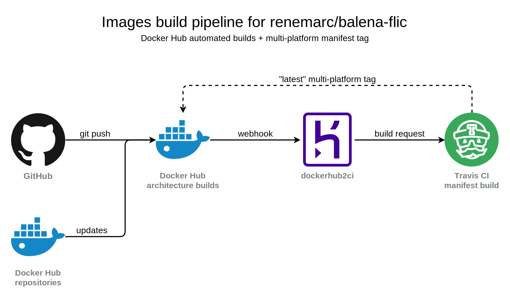

<h1 align="center">
  🔘<br/>Flic smart button bridge<br/> <sup><sub>a <a href="https://balena.io">balena</a> and Docker container 🐳</sub></sup>
</h1>

[![Price][img-price]][link-license]
[![License][img-license]][link-license]
[![GitHub Release][img-release]][link-release]
[![Flic SDK Version][img-flic-sdk]][link-flic-sdk]
[![Docker][img-docker-hub]][link-docker-hub]
[![Travis CI][img-travis]][link-travis]
[![balena.io][img-balena]][link-balena]
[![PRs Welcome][img-prs]][link-prs]
[![Tweet][img-twitter]][link-twitter]


Turn a [Raspberry Pi](https://www.raspberrypi.org/) or many single-board computers into a plug-in appliance to bridge your Bluetooth [Flic smart buttons](https://flic.io/) to your home automation system of choice, like [Home Assistant](https://www.home-assistant.io/).

Useful if your Flic buttons are located too far from your home automation hub, or if you need to use your hub's bluetooth antenna for something else.

- [balena Dockerfile](#dockerfiles-) for ARM architecture based on [Alpine Linux](https://alpinelinux.org/about/) that weighs less than 30 MiB on a Raspberry Pi. ⚖️
- [Regular Dockerfiles](#dockerfiles-) are available for traditional Docker stacks. 🐳
- Pre-built Docker images with multi-platform support [are automatically kept updated on Docker Hub](https://hub.docker.com/r/renemarc/balena-flic): ARM ones are Alpine-based while x86 ones are using Debian.

<div align="center">
    <figure>
        <div>
            <a href="https://www.draw.io/?title=flic%2Bbalena%3Dlove.xml#R5VdLc9sgEP41Otajpx%2FH2KmTQzuTGR96xhKWmCKhIhw7%2BfVdXrIwcpyZqr1UBxt9sCvY%2FfYDgmRTn584aqvvrMA0iMPiHCSPQRwv0iX8SuBNA2lkgJKTQkPRBdiRd2zA0KBHUuDOGSgYo4K0LpizpsG50JixRZyzU%2BdAB0bdr7aoxB6wyxH10R%2BkEJVBozC8dDxjUlbm08vMdOxR%2FrPk7NiY7zWswbqnRtaNGdpVqGCnAZR8DZINZ0zoVn3eYCqjaiOm7bY3evspc9yIzxgkc23xiujRLPuFmKmJNxuJStQUWlGQrF8xFwRi9A3tMX1hHRGENdBXk6KQw9eIklICOcwAcwCoHLnuQ7JhlAH8qIJy8fdgzHo%2FneDsZx%2F4uEesfRAn2%2B0GHug5EEoHOM6iFJIEFja68qVAXYUL8wI9rVxcfS4ld2eEdYsZASZ1swojDrFbq9n2BjmrSW7aB9aILaoJlcTeqI443KGmg7%2FvuyDewP8DJ4jq5jOmr1guUr92MPBLhzk5GFeG%2BVAu%2Bn2wkoN6ZFS7VlP8QM5yTjqqg%2Fj34fYZYEghI43PA8gw4gmzGgv%2BBkNs5WaJNjGFm8SZfj9dygDKeRabeq4GRRDb6kCm%2Bsre%2FYWG0DBMvMHKhcfKIF57tITlqEThjryjvUJletBRQFxUTKMxQt6kXMtII9S0s3WQPV4RyxDWZaEBXa5MzQ%2Bz4miEL4PKnCDxyTx0Ep9aKR4kPg39pCdT5Hzp5XxLZeSuku6U8c0q8JJ%2BXfBlXdAZRwVh%2B6MQ0tjXlzBcZcuFry897muUV6d39fImG%2B9Iw1Y907LN0csJ%2BBTFnxCScIRQ06jIakRF5lSYmDm0mv86MtvxRYvHAwxIl%2B1ZhcL2Q6tU%2F8pI%2BdrzP%2FNk3MBq9KwsPC52g4L%2Fn3VvAnLOFy45%2F6XYpZFHzT2cOxs0JNUNIlglq%2FAZlUq4WggaTEEm2aIvFpKidKqIwLsW5dLsBPLn8ugvHmc4E8gI3iocOagl%2BVIf1Pyj3eNqPv%2FwFOaI1a1zk6mHcAb7S7aI0lj%2FrlLpu2KcvIMhotalp%2BcT8Cy1Z2wrgonPs1ERjFZTMC0bEcErRuGmeJD3pUtd36HEx5vTqGCobVM%2B0NMwtRsa%2BjEgJhFv93YdXDi3NT%2Fcg3BmI9G0GMcUKPnq3vHGImy%2B8CLF8faWlmVz10XHjjzHxmp487pytFosrhxlriOBeImF50glvF%2F2GAfg9XKB1MMv9%2FPk628%3D" title="The Love Pi equation.">
            </a>
        </div>
        <figcaption>
            <p><strong>The Love Pi equation.</strong></p>
        </figcaption>
    </figure>
</div>

**[Why balena and balenaCloud?](https://www.balena.io/what-is-balena)** All the goodness of [Docker](https://www.docker.com/why-docker), plus security handling, IoT hardware optimized base images, a build pipeline, a device management interface, and continuous deployment, _for free_ (well, first 10 devices). Do you really want to micro-manage and baby something that should really be set-and-forget hardware? I surely don't.

<p align="right"><a href="#top" title="Back to top">🔝</a></p>


## Table of contents

1. [Prerequisites](#prerequisites-)
2. [Installation](#installation)
3. [Pairing](#pairing-)
4. [Unpairing](#unpairing-)
5. [Dockerfiles](#dockerfiles-)
6. [Alternatives](#alternatives-)
7. [Contributing](#contributing-)
8. [Thanks](#thanks-)

<p align="right"><a href="#top" title="Back to top">🔝</a></p>


## Prerequisites ✅

1. [Your favourite single-board computer](https://www.balena.io/docs/reference/hardware/devices/) that offers both network access and Bluetooth Low Energy, like the inexpensive [Raspberry Pi Zero W](https://www.raspberrypi.org/products/raspberry-pi-zero-w/).
2. A developer-friendly home automation platform that supports Flic buttons, like the polyvalent [Home Assistant](https://www.home-assistant.io/components/binary_sensor.flic/).
3. [A free-tier account](https://dashboard.balena-cloud.com/signup) on [balenaCloud](https://balena-cloud.com/) along with [a properly set SSH public key](https://www.balena.io/docs/learn/getting-started/raspberrypi3/nodejs/#adding-an-ssh-key) into your account.
4. (Optionally) The [balena command-line tools](https://www.balena.io/docs/reference/cli/). Do read on their [friendly development guidelines](https://www.balena.io/docs/learn/develop/local-mode/).

Let's play! 😃

<p align="right"><a href="#top" title="Back to top">🔝</a></p>


## Preparation

1. [Create a new application](https://dashboard.balena-cloud.com/login) on balenaCloud dashboard and select the appropriate [Internet of Things](https://en.wikipedia.org/wiki/Internet_of_things) (IoT) hardware.
2. Add a new device to your app. Start with development mode for local testing, or go directly for production if you know what you're doing.
3. (Optionally) Configure the downloaded image to give your device a custom hostname instead of the generic `balena`:
   ```sh
   sudo balena local configure /path/to/downloaded/image.img
   ```
4. [Burn the image](https://www.balena.io/etcher/) to a disk and boot your IoT device.

<p align="right"><a href="#top" title="Back to top">🔝</a></p>


## Installation

1. Git clone this repository:
   ```sh
   git clone git@github.com:renemarc/balena-flic.git
   ```
2. Add your balena application as a secondary remote to the cloned repo:  
   ```sh
   git remote add balena <username>@git.balena-cloud.com:<username>/<appname>.git
   ```
3. Push the code to balenaCloud and wait for it to build and provision your device:
   ```sh
   git push balena master
   ```

<p align="right"><a href="#top" title="Back to top">🔝</a></p>


## Pairing 💑

Since only one controller can be paired at a time, do make sure that your Flic button is unpaired from your mobile device by using the Flic mobile app to remove the button from its interface.


### The easy way: Automatic pairing 🤖

Configure your Home Assistant (or other automation system) by pointing it to your device, say `flic.local` or `192.168.0.4`, reload your configuration/restart the system, and [let its auto-discovery system locate your button](https://www.home-assistant.io/components/discovery/) by pressing it for 7 seconds.

```yaml
# Example Home Assistant configuration.yaml entry
binary_sensor:
  - platform: flic
    host: flic.local
    port: 5551
    discovery: true
```

<div align="center">
    <figure>
        <div>
            <a href="https://www.youtube.com/watch?v=6OEFxc3zTls" title="That was easy!"></a>
        </div>
        <figcaption>
            <p><strong>The easy way.</strong></p>
        </figcaption>
    </figure>
</div>

<p align="right"><a href="#top" title="Back to top">🔝</a></p>


### The harder way: Manual pairing 🔩

Use this manual approach to [pair your button](https://medium.com/@vaughan.stedman/flic-beyond-the-phone-home-assistant-on-the-raspberry-pi-9095d6b782bf@f739) if your home automation solution requires a more hands-on configuration.

1. SSH into your device's main container or use the balenaCloud dashboard terminal by starting the configuration tool:
   ```sh
   simpleclient localhost
   ```
2. Start the manual pairing procedure by issuing the following command to `simpleclient` and pressing on your Flic button for 7 seconds (or until something positive comes up on screen).
   ```sh
   startScanWizard
   ```
3. Take note of the MAC address shown to help you differentiate your various Flic buttons, then quit `simpleclient` by using `CTRL+C` then you are done.
4. Restart your home automation hub to have the changes be recognized.

<div align="center">
    <figure>
        <div>
            <a href="https://imgur.com/r/thesimpsons/TtJanGk" title="...or the Homer way."></a>
        </div>
        <figcaption>
            <p><strong>The harder way.</strong></p>
        </figcaption>
    </figure>
</div>

<p align="right"><a href="#top" title="Back to top">🔝</a></p>


## Unpairing 💔

All buttons paired to your bridge have their configuration stored in the SQLite database found at `/data/flic.sqlite`. To [unpair a button](https://github.com/49ButtonsEach/fliclib-linux-hci/issues/47) requires those entries to be removed and the changes be recognized.


### Unpairing gracefully 🤝

**Note: this method isn't currently working. Bummer. [Use the manual approach below instead](#unpairing-manually-️).**

1. SSH into your device's main container or use the balenaCloud dashboard terminal and start the configuration tool:
   ```sh
   simpleclient localhost
   ```
2. List verified buttons:
   ```sh
   getInfo
   ```
3. Remove the unwanted button from the verified list, using its MAC address:
   ```sh
   removeButton 80:e4:da:XX:XX:XX
   ```
4. Restart your home automation hub to have the changes be recognized.

<p align="right"><a href="#top" title="Back to top">🔝</a></p>


### Unpairing manually 🖐️

Don't mind getting your hands a bit dirty? Dive in!

1. SSH into your device's main container or use the balenaCloud dashboard terminal and install SQLite:
   ```sh
   apk add sqlite
   ```
2. Open the database:
   ```sh
   sqlite3 /data/flic.sqlite
   ```
3. Delete your button's corresponding row from the database, using its MAC address:
   ```sql
   DELETE FROM buttons WHERE bdaddr = "80:e4:da:XX:XX:XX";
   .quit
   ```
4. Restart the bridge's main container.
5. Restart your home automation hub to have the changes be recognized.

<p align="right"><a href="#top" title="Back to top">🔝</a></p>


### Unpairing forcefully 💪

Patience, you must have. Use the Force, my young Padawan. ✨

1. Temporarily stop the main container, or turn off the bridge altogether, or walk out of range with your Flic (50+ meters).
2. Click the button once to see its light pulse red.
3. Use the Flic mobile app and follow their instructions to reclaim control. 
4. Restart your home automation hub to have the button sensor removed from its list.

<p align="right"><a href="#top" title="Back to top">🔝</a></p>


## Dockerfiles 🐳

Which [Dockerfile](https://docs.docker.com/engine/reference/builder/) to use? balenaCloud will pick [`Dockerfile.template`](../Dockerfile.template) for you. Easy!


### [`⚙️ Dockerfile.template`](../Dockerfile.template)

balenaCloud will automatically pick this one, which employs placeholders so that the correct system architecture is used at build time. It should work on ARM systems only.


### [`⚙️ Dockerfile`](../Dockerfile)

Should you want to build your own Docker image, this default Dockerfile for [ARM architecture](https://en.wikipedia.org/wiki/ARM_architecture) will build one for Raspberry Pi. Just change the `FROM balenalib/rpi...` part with [other supported base images](https://www.balena.io/docs/reference/base-images/base-images/) if you use some other hardware. The file supports [QEMU virtualization](https://en.wikipedia.org/wiki/QEMU) so that ARM images can be built on non-ARM hardware.

Docker Hub uses this image to create automated builds; the file is automatically modified to support different architectures thanks to the [`hooks/post_checkout`](../hooks/post_checkout) Docker hook.


### [`⚙️ Dockerfile-debian.Dockerfile`](../Dockerfile-debian.Dockerfile)

Same as [`Dockerfile`](../Dockerfile) above, but meant to support the [x86_64 architecture](https://en.wikipedia.org/wiki/X86-64), as well as i386](https://en.wikipedia.org/wiki/i386) through the same `post_checkout` Docker hook. The word Dockerfile is repeated for aestetic reasons: this groups Dockerfiles together and enables code highlighting.

<div align="center">
    <figure>
        <div>
            <a href="https://www.draw.io/?title=build-pipeline.xml#R7VzbdptYtv2aPFYPbnLHj7JRHDIMBBvZkd8QUhBIstwSNoKvP2vOtZFvcZLqTtU5PU5SIyVAm31Z1znX3so793S9P9tmd4twM5uv3jnWbP%2FO9d85zpHjyv%2FxoNUHrvdeHxTbcqaP7McHl2U3Nw8t8%2FS%2BnM13zxrWm82qLu%2BeP8w3t7fzvH72LNtuN83zZl83q%2Bej3mXF%2FNWDyzxbvX56Xc7qhXlqW9bjFx%2FnZbEwQ78fmC%2BmWb4stpv7WzPe7eZ2rt%2Bss74b03S3yGab5skjd%2FTOPd1uNrVerfen8xWk2ktM3%2FvwxreHKW%2Fnt%2FVPvXCkbzxkq3uz7GY%2BXWw2SzO%2Fuu3FMZ%2BJdMztZlsvNsXmNluNHp%2BecMlz9GzL3aJer8zlfF%2FWX55cT%2BTa%2BscAd7f1tsVXVn%2Fz%2BF01r%2BvWmEV2X2%2Fk0eO455vNnenxYb6tS1HbcFUWt%2FJsuqnrzVq%2BWGXT%2BerzZlfW5QZf5DLAfPvkjfMXDWr0eZKZfg7Nv25uazMPkZe5N5LAvHf1drM82Ijo8ESFB4m9qRfzaLe53%2BZ9q97Ks20x75t5B6sQP5tv1nORkbTZzldZXT487z8zFl8c2j2qXi6M9t%2BwBPuVJfibfCkCcKyP99N3jliKa2O52TZflLV43P12Dmu%2FL1ez3ZPvX1mOGPkdLss1Pe5N8T9X3MnBi043q82WXblf%2BecbSjeq291pJPha7mGIJxxy2D%2B1%2BidyPcvq7J071Fvnw%2B6heOec7MVkndPPHyPnpj3xptf7%2B7yzyuzjhZX7m4dzd%2BbO2oEbtoOHfJ0%2FhNWwCU%2BPu9k6L4OzD212PaqnZx%2FKm%2Bv97ub6opynVpk7qzo%2F26%2By6%2BhhehvWN2fHVeZctefXq2rqeGXw8dPD9Gx8HKxX9U0bFLP1ajWzPj3MfasMT4dN4AcW%2F1be%2B9nZypK2RXadHAe30d30y4mMg34G3fn1xcPEqVd5ad9NnOP7oBqMpk60vfkSFBy7ah7M%2B7LOzx9PFrOzoriRUdI0uY%2F9oAjT%2FD6scnvSWvdRVciowzq89LrQT%2Brzauycp6P7sBta%2FKwuusOzKukCn9%2FZ%2Ff2k9dzILwpZwf68Cvdoq21GhfTZRv6n7vzSc8Iq0PtTC%2B2a6BLtA2u%2BtvZR6TVhGtTy6UZVVEn7fdiNZS7LQVjKHOVa3vUwZpRO6rD0rHDd1BgvurRkHmgb2NGprOE6lOtkINd2hHerJca1oxTPJzL%2FQNov7fNq6GCu0pfMCXMZtXJv6zU%2B2a8lzzF%2FW%2BRkxikwfzeC7CDHtHApizSwMAfOkW2vAhljEDmYJ8YKXchb2mE%2B%2Bxjz8CcF11Kif3neyudZA7lKX0kXfZlIm5sK88e8Rc4y%2F0T6yNFW5Czj%2B7kX%2BOF9VIpOqrGsG5Y0amTenshO1pS0ci%2BfoS1zdiGDsMUakza69BqOW3peVCWUJ%2FtKE8jbibqbHfo5h21Azpx%2FwXXE%2FsjIGfpctpQRxytstr%2FmuvfxqejW%2F3Q0vbQ8uW9ikWucLtvsVOcWf5zwM%2BP6outY%2BgnTxU76kPcgo2EnNtKcp6FcJ91b74ntWPEZx2xgM8%2FeS4fWG%2B%2BJXePz00bHk3nKfSzylf72kT8LQrzfLRy1uYLvXlVLkdHIm55yHJdjunf1eVpgbaKPkwC2GEv%2FT98LV5OB6Ghv5rnv3xNdNqKTRud4oe8sC2lbWM%2FHGtmPY8E2wiIcwR4vno0Tf3g2Tte%2FQz9rLdxboVPQj2YV1x%2BI3L3ow0TsNHkcizKJoDu%2BIz7bXML%2BusLt35M%2BvatqItdGZ%2BKfOt5GIuXN3fSsOQ5K8VO%2F8CRalOed9%2F7clajbeYjz30nd303OgxfJ2Tb3TxLIewv%2FHbIU0sh8%2F%2F0k%2FTr5mhfco3%2FqKz3AtQFc%2BKR5Ahh7vLh4ghUPD%2F%2BjlD14lbKLssYS7neLX4rf%2Fk6Utpp%2FrX8ao21VpD%2BEaG8j0F8G3o6%2FAd7esJ%2BfBm%2Fm1c%2Bb8rZ%2BtDvHOe7trLe8o4Pl9d3o3MybL2zqMJWfMrOeqzwxM0F7%2F7oHRxHt1fNd%2FXgPknMvHO2PO%2Fnm62a7pkiKv4JNGAbRa%2FOZnT6Si%2F67n7XTl5a0u8vy8rYwtmHuzmmj7PdXkYw3%2FePHbGOW7RYHQf2b1uv%2BVdY73G6z9kmDO1jk7m3jPh7Yz0zbOXrBYF%2B093oK%2B%2B32cqEz%2BHetv5fME%2BtPt9lDKUuwToMntGed3ZZf6QtKiX4zop9jRLOPnxbCerqJs6z5rAyKfH28u5G22bV9G5QnTnZ95SbrY%2B%2FzZSA4dlgIFsbf8nO1t7IvF7uby5M7cJmf6FvWdGWeBqPoU3BGHibo4%2BJuJm9Kj83ky8UmOBOOtRQWAjTsy2iKCHdAaHgmjEJR%2B%2BlQkHlgk534gr4qIOCgFeTd8FkVyL0%2Bk%2FuWKLTqkeVN9djGIFS0A0Mg0wgEeQV7RfwfKo4l8xDk6nCMU%2BmvwpgfjtJ0KZ9hod9faf%2FprO9f5sn%2B8K7Og2wv6GZAf7604%2FhsS2TM%2BWKMFm0XG37vcM3OAYVXgavrHutc0W9L9NvquOHztfM%2BaOci11DmHkGL6ViYUW5PhR1GnawhDckUo2pCxhClnyqyMIxZJffUPOTQybU%2F24XsVxA2dAQmiTWkC7zTkQW2ZJfSHxD7yJJ%2BBtG6IPsSRNsBGcszK6ouKKuIc%2BT8hflSdx3nQd0U9pR9jciCo47ybSKyUkHCYJb%2BxH5EvBOL9tNd7Mh2ybDyPRmfsBbp24rInuQdsSGwIJkjrr1ImKzMvYtEtlFXGLYotqd2J%2BPQBjzp341TIO3CMMgbyMTYUqFz6bimLiaLHZLFxmliCUtvYshIGCTsTHUGJE%2B97V%2Bg9S4ej7xoHBCt52cfhD2dLD9ffopk%2FiL%2FJaoALhitMoUczK5TJph3lK3DebiP8hl1XDMrDIFhaDlkDOZtQ39iE44yfOrPNrKzUZ1AX%2FRFsviRMNqTnTLtifpjl7NaIIxJ5BkaHcGfqdcGDCvStTroJxZ2GkKekHn6wegWdka7Ub9PE%2FVvYT2wWbF9I%2FcE7NuK07EyYLEZ6jy9qag7zIesc4LnreoOOgJzDzrVU6DVBVzT5mT8dYPKQss1lGKX1RLfCwuH34Q1de1jzDFsv9VKRy%2BXpFY%2FIMNDbLoHc0tTMP9kD3uIMQ5Ymvq%2FvPNJ112hikHZDFANoW66EDZnGf200FF8Br2MYcsNbBExROa5p3x5Lczdz018o%2F2pnam%2FWhF1FO3ol1wH5YMKQRfd3kX0ZzBa%2BlshTJ%2BMfKcVDPhBIrYcyndD1MnkmgxV5ZMWpvKSuLB1kS%2Fm4UHvsQ%2BfEhvjHHvZ0I87VIlkTFQ%2BbFatfBOL0K%2FE9eAUcy1kbMTnpdh5Ity1wXiuxq7c0bmgzdBDJYS2LLqW2GGfM0aHzoSse%2BnSH1kJGQ0gB%2BhN4%2FiEthD5s6NpGkJeHitBGl8lB2ENASsvEeuE8InJQH2KFRpUvPa0Efo5%2FHO0Z8ypRD7%2B0uG6VD%2FqM%2FSvHONKfM7VlhDz%2FKHaZcW45qGyotW%2Bsfh%2B6JprVAoQZyAjN4J%2B0rHEs1zlWCWsVMi7TpxCF7CnCWOg6NuJKlRaxqiWoArRxMx7I%2BjOig6VjsKirYssYq2atSGrHpAX40IhMhloLMEaA%2BhH7d9PZP3IVWIvrELSlzXX0m8nWplqYd9BI7JrVDaJpb7BSl8TPV53IaulueZEVgJRZQlMZXSCSqO5zp25IJub9Wo3FaQSdOEgEftMyuDhJeYQP2kSsV%2BJXx3RzimqeKGLahCqdvnhu1H79O95%2BvhcxmzHndhANZEcru9JfBT5FiIHVKNQDQw9jacTVC3p61qBHTqq80B9VOMI5LGnbSGn9nEOGESrelakNmZnqiuTB5IX%2BRAxTGR%2BFpoqlPTLOSyBOWpWFsWmmWd9VJ5CYBSJ5Vcal0qvY85K%2B7wY2Dpn8eXrRmyxoE0rVin6WNhJHK8NdrNDrSQj7raag3GPvDd2dU7jVmNcstfKcH6QU6hjw49c%2BojIQtvmqM42ui7mHBkXlbvAVLWTmvmBOfgiJHashrKGxFF5Md8MYlbNWT1Vm%2B1G8AXxF6ylMGMFwBV7wRXEeZrbRtQz56T%2BrProQmK0CLkNsVirsa1Wnc131CXjZhfTJ4Za3U6Zm2zFRbCtRDGe4C1jE8RtjM2iK%2FZZsU8bcopQBU0P8ZN5ABVkE2cbtZcn15eKmSPa03jP%2BWg%2BGzBG%2BxMTsw1mQtv2CS6TmM01Eo%2BFFt4zeOFQuTT5XGPdwY8Va6A6jPXF9IXh4PxgN0GruZoYV%2B2PeavAWiU20FZMH5NW8z7X1ep3I8QrwVYF1m8rFsMaGI%2FbQ%2F5htR32DD3kPS5x1edo4x53PvwQVX1P7SsXO4PNhpbYi4X4KHaAXQz7cO%2Bi%2FdKlLfusYotux4X4LnCRrIW4G3GavsdYLfxAxxkxJiLPhprzu0j938R7xOTQixEbELt95ENgDu6Y%2FAkMWRAbBf4SsUDs%2FICr3eisUN%2FVmDFAfiFGYA5RnWkMKTTWpiZfSzwRHXe644O8G5o4l6uugKsOOCnhLkRo8L7BcVakYzXK9TAGdnSGJp%2BExOS6A4K4pjhPfLjnSa2ON7RZzafdwh9CxZPEJPRhL6wukAtd4ntiEez2hD3PAxa0QuURPZ5vhRcSZ4kOkW%2F7fLbXecNOkP8S69IfoZ36AvkTvjNtLz3T9uo6xu7YddgoP0xMTgwHwEG08%2B7KIbZaayxSfQSW4XydtskVyxOTcJ1W5N9cI%2B7KGJXyUOAAMzZ2lnyVdeiAh0wUU1Z9LsdaZD5sm2CeDq8drnmvORf5MVCOliLfh5RtRKwyJCdU%2FJCQ0xrd6a4luGsa2uobGB%2FPsau0VJsBpkXcKomNgL%2BxY4Z5Osi3iJ3YddNdrvGAMZg7qoliQcHQXDt9dIJcNFBc3ect5iuR25g7boo7kV8CE09C5ZT0M%2BUVMfG88lrmQYNP5Tn5B%2FIbcrXJPzbzErlu2IGLGVlYxneaGLUAn7Hd1Duod5cxizutIflppLFsz%2F5Kk9tVjw1x%2FmWP0ZaWcg7Jw8Rmy35XFDuEiDsOYh3nmSYF5m365k4rcFcMXgWeL3xQc05CzHzONSa9j7u8Vqzu9jxHMFcfFwaaQzXPGaymeRs7xj1P7nLrZ7EZ8XSJ3T3lz1FqbOyUdRDaImJhpLmK9%2FRzxTYN5avcF1x0b2ohrtixxuVqtoEcyFeYAwLJFbJ%2BrjFp5dr4a%2BBmeA5cBDygvER8RORd6id8%2F4q5%2BkprRxrb9tEhh00Y42fgdw52KSPN7%2BTpQRP3PsM6zETzIGsU4z4eYIfVjh%2F92nn068nBryVe4MQA52l8GjlkT72jH11zF33EGGNPdzxzZ4a%2BP76dP%2F77dgyPLevlzs3fvWf4z1flbFOttrbzf92zfv374NffffDL%2B8bui%2Ft3HfzyXlnEjAe%2FFvdTJy9%2F7118Z%2B8iO7tqp05t%2F%2FrTXItVvj7ezi4Pp7mCmy%2BfHjJ3%2FMPTXEGDOgZOmyD%2FxmPUDkdefMkaAGsfcTrRukkLzDpyZqg7VRMvFOyn2B8YfmnH5Oqj%2FpM1LcEbg4x1pKCddNK25Kr4nPWmalSw7qc1HPlcXfNzGQoX8lyJ%2BwPUMVHLEiyMHN%2BGwAMyv%2Fna0rkJ%2FhX8tJ90yBVj5irJd%2BDEDsco5e%2BSWI2YFhgiZE17whwJHKLXS%2BeK%2Bxk3zE%2Fgs1r7XQJDklNKu%2F1hPS2445K4Q2vqZky0F6wt%2BcqJfey1oK4Tkr9L%2B0EKztKhRrnY8eRQqyd2BBMIPlkdTVPBP11Qx8CS6apifuyAURJPT9XlA%2BXJPH3j4Ttgk5hcf9KSF7P%2BrSe0ZH2ogYmMLq6BPQ8nhFLMZ4H6v4PcHXWLjjIntgpEf8C6xD2tcAY8Myf0UEumTZg63Y0DjsfTUJKTca1YB3MeufGlXofk9CMjT%2BJf3dtpwW2Aka42wCK0E7%2FQcVkDFo4MOaXBHuPFxKarDeuiIk%2FDU%2FZ6YjCHXXmRT7tydD%2BhaELi6dVRUJ6sM%2FHQz5dBJVimYW2rfA%2BvUF%2BWq%2F8WdHDkev%2B72OD4VSY4K%2Bvnh39%2Fp4PvHe51Vlb28ar89elgdjc7W9iTx8O9H7MvF8Hs%2BseHe0ctSgMxtoL7sHXKErMpKfN6r2EcJb4h6a%2B4kodSTHyK7QstYYYsS0moKHUrK2Yoxbalp2WpNHd1C8JsbUloQBg7lO7h3j7LoF3YFQiJ1jnpW9LqNs2o1pJ7oGXCMUp4Eu5KPTAqIaXrD6pKSHI5T9J1hG%2Bsj2EG9M5lucovLNL3avn0WlMf1urjkDNSDdbK1Oh86x4lM6arA0VnHx23%2FnTLjwc8Qe807ObYBkFp0hxq7kPwpFFKPnF0a9oCNXf0O0kg5eEeFLo7HMDm9vSYpSwtHwfY2u7Mtro5FB0q9dVDujbSvKQDWw%2B6YjtqaEK9KbV2QcsyR6v9mdSKLR%2BsTbeQJBQHSjtNCZslrka3IYeWbt%2BKvQjtpCyERmrKGtuis87YAfvnWFVhDohDb4mtW2XYOgx0687PO93G1TmDAmKbJzJrpm7SUQ9duH6si%2BUEyrXAPG1ueVxSlq7eL3kAVstphaYVbH3xmscYjGwmpqwxsnU%2BS93WSannNsbBbB49GGnZg1s9RcvyjhUCxgh9l7aAHP6yVe%2BGbY4HIg8eKKeMxBfFBx3dmrGe%2BGH%2F92kpYiQwKRdbQimiecjdm9vPBRmv%2FwOCYv%2FptPdXkd5XpxX%2F5rzm%2FOinLRZY5jqr57Mnv2exgBy%2BcZrxyTmvbx1sFDnVz0nwdr4ru2x6YI3mBJy0Hpy8G0CNGH5n1PgzZwM1H5qziCn58B%2FeN8zhFyjPdb1%2FHD%2F58959pkrbnLZ7qkjP%2FYYinV%2Bhx9e1i%2Fu7GQ6g%2FvfULF6q6Jecfn6zELLYbMtORsz6xf2qigUe%2FOx5UWNJf4ig3CPj93%2FtGVK3%2FwmpsdKB9%2F0zpC%2Fbu987Q%2Fr4dj%2Bdzdevu%2Fl%2FfMra%2BUGQOkDw7fwOBiGqnf%2F%2B2d3vn939%2Ftnd75%2Fd%2Ff7Z3e%2Bf3f2%2F%2BdndKz7hHf%2FNfOL9q1QdIJ%2FtHn%2F6Yd2Vd%2FNViX%2F3wRLeQMRzO19n21w6n2ar%2BW32x9dVmf9fpQ%2ByxFc6tPjn1%2BjQGRw%2FoxXPf0hp92DoiToH77%2BhTu%2FPa1NuH%2F95DcVpj%2F96iTv6Hw%3D%3D">
            </a>
        </div>
        <figcaption>
            <p><strong><a href="https://hub.docker.com/r/renemarc/balena-flic">Docker images build pipeline details on Docker Hub.</a></strong></p>
        </figcaption>
    </figure>
</div>

<p align="right"><a href="#top" title="Back to top">🔝</a></p>


## Alternatives 🔘

Other options exist, should you wish to try something else:

- [The official Flic hub](https://flic.io/flic-hub): USD $100 each, plug-n-play, supported. While it runs the same SDK as this balena project, it's likely a better solution if you have the money to spend. 
- [Flicd Hass.io addon](https://github.com/pschmitt/hassio-addons) by [**@pschmitt**](https://github.com/pschmitt): for Home Assistant running on the HassOS stack. Requires exclusive access to Bluetooth antenna.
- [Raspberry Pi 3 Docker image](https://hub.docker.com/r/superkikim/flicd-rpi3/) by [**@superkikim**](https://community.flic.io/topic/10/flic-for-pi3/16): based on Raspbian.
- Or this guy: 

<div align="center">
    <figure>
        <div>
            <a href="https://giphy.com/gifs/naxep4vNBAOL6" title="Catpocalypse!"></a>
        </div>
        <figcaption>
            <p><strong>i can has nuke button?</strong></p>
        </figcaption>
    </figure>
</div>

<p align="right"><a href="#top" title="Back to top">🔝</a></p>


## Contributing 📝

Want to suggest some Docker improvements? Got some fringe hardware that you used to run this balena/Docker container on and had to tweak it to work? Fork this repo and [open a pull request](../compare) so that all can benefit! 😃

<p align="right"><a href="#top" title="Back to top">🔝</a></p>


## Thanks 💕

This Docker container is based on the [Hass.io addon](https://github.com/pschmitt/hassio-addons/blob/master/flicd/Dockerfile) by Philipp Schmitt ([**@pschmitt**](https://github.com/pschmitt)) and uses the official [Flic SDK](https://github.com/50ButtonsEach/fliclib-linux-hci) by [Shortcut Labs](https://flic.io/) ([**@50ButtonsEach**](https://github.com/50ButtonsEach/)).

<p align="right"><a href="#top" title="Back to top">🔝</a></p>


<p align="center"><strong>Don't forget to <a href="#" title="star">⭐️</a> this repo! 😃<br/><sub>Assembled with <b title="love">❤️</b> in Montréal.</sub></strong></p>


<!-- Image references. -->

[img-docker-hub]:https://img.shields.io/docker/automated/renemarc/balena-flic.svg?logo=docker&maxAge=21600
[img-flic-sdk]:https://img.shields.io/badge/uses_Flic_SDK-0.5-blue.svg?logo=data:image/svg+xml;base64,PD94bWwgdmVyc2lvbj0iMS4wIiBlbmNvZGluZz0iVVRGLTgiPz48IURPQ1RZUEUgc3ZnIFBVQkxJQyAiLS8vVzNDLy9EVEQgU1ZHIDEuMS8vRU4iICJodHRwOi8vd3d3LnczLm9yZy9HcmFwaGljcy9TVkcvMS4xL0RURC9zdmcxMS5kdGQiPjxzdmcgeG1sbnM9Imh0dHA6Ly93d3cudzMub3JnLzIwMDAvc3ZnIiB4bWxuczp4bGluaz0iaHR0cDovL3d3dy53My5vcmcvMTk5OS94bGluayIgdmVyc2lvbj0iMS4xIiB3aWR0aD0iMjQiIGhlaWdodD0iMjQiIHZpZXdCb3g9IjAgMCAyNCAyNCI+PHBhdGggZD0iTTEyLDIwQTgsOCAwIDAsMSA0LDEyQTgsOCAwIDAsMSAxMiw0QTgsOCAwIDAsMSAyMCwxMkE4LDggMCAwLDEgMTIsMjBNMTIsMkExMCwxMCAwIDAsMCAyLDEyQTEwLDEwIDAgMCwwIDEyLDIyQTEwLDEwIDAgMCwwIDIyLDEyQTEwLDEwIDAgMCwwIDEyLDJNMTIsN0E1LDUgMCAwLDAgNywxMkE1LDUgMCAwLDAgMTIsMTdBNSw1IDAgMCwwIDE3LDEyQTUsNSAwIDAsMCAxMiw3WiIgZmlsbD0iI2ZmZmZmZiIgLz48L3N2Zz4K&maxAge=21600
[img-license]:https://img.shields.io/github/license/renemarc/balena-flic.svg?logo=data:image/svg+xml;base64,PD94bWwgdmVyc2lvbj0iMS4wIiBlbmNvZGluZz0iVVRGLTgiPz48IURPQ1RZUEUgc3ZnIFBVQkxJQyAiLS8vVzNDLy9EVEQgU1ZHIDEuMS8vRU4iICJodHRwOi8vd3d3LnczLm9yZy9HcmFwaGljcy9TVkcvMS4xL0RURC9zdmcxMS5kdGQiPjxzdmcgeG1sbnM9Imh0dHA6Ly93d3cudzMub3JnLzIwMDAvc3ZnIiB4bWxuczp4bGluaz0iaHR0cDovL3d3dy53My5vcmcvMTk5OS94bGluayIgdmVyc2lvbj0iMS4xIiB3aWR0aD0iMjQiIGhlaWdodD0iMjQiIHZpZXdCb3g9IjAgMCAyNCAyNCI+PHBhdGggZD0iTTE3LjgsMjBDMTcuNCwyMS4yIDE2LjMsMjIgMTUsMjJINUMzLjMsMjIgMiwyMC43IDIsMTlWMThINUwxNC4yLDE4QzE0LjYsMTkuMiAxNS43LDIwIDE3LDIwSDE3LjhNMTksMkMyMC43LDIgMjIsMy4zIDIyLDVWNkgyMFY1QzIwLDQuNCAxOS42LDQgMTksNEMxOC40LDQgMTgsNC40IDE4LDVWMThIMTdDMTYuNCwxOCAxNiwxNy42IDE2LDE3VjE2SDVWNUM1LDMuMyA2LjMsMiA4LDJIMTlNOCw2VjhIMTVWNkg4TTgsMTBWMTJIMTRWMTBIOFoiIGZpbGw9IiNmZmZmZmYiIC8+PC9zdmc+Cg==&maxAge=86400
[img-price]:https://img.shields.io/badge/price-FREE-53c1f1.svg?logo=data:image/svg+xml;base64,PD94bWwgdmVyc2lvbj0iMS4wIiBlbmNvZGluZz0iVVRGLTgiPz48IURPQ1RZUEUgc3ZnIFBVQkxJQyAiLS8vVzNDLy9EVEQgU1ZHIDEuMS8vRU4iICJodHRwOi8vd3d3LnczLm9yZy9HcmFwaGljcy9TVkcvMS4xL0RURC9zdmcxMS5kdGQiPjxzdmcgeG1sbnM9Imh0dHA6Ly93d3cudzMub3JnLzIwMDAvc3ZnIiB4bWxuczp4bGluaz0iaHR0cDovL3d3dy53My5vcmcvMTk5OS94bGluayIgdmVyc2lvbj0iMS4xIiB3aWR0aD0iMjQiIGhlaWdodD0iMjQiIHZpZXdCb3g9IjAgMCAyNCAyNCI+PHBhdGggZD0iTTcsMTVIOUM5LDE2LjA4IDEwLjM3LDE3IDEyLDE3QzEzLjYzLDE3IDE1LDE2LjA4IDE1LDE1QzE1LDEzLjkgMTMuOTYsMTMuNSAxMS43NiwxMi45N0M5LjY0LDEyLjQ0IDcsMTEuNzggNyw5QzcsNy4yMSA4LjQ3LDUuNjkgMTAuNSw1LjE4VjNIMTMuNVY1LjE4QzE1LjUzLDUuNjkgMTcsNy4yMSAxNyw5SDE1QzE1LDcuOTIgMTMuNjMsNyAxMiw3QzEwLjM3LDcgOSw3LjkyIDksOUM5LDEwLjEgMTAuMDQsMTAuNSAxMi4yNCwxMS4wM0MxNC4zNiwxMS41NiAxNywxMi4yMiAxNywxNUMxNywxNi43OSAxNS41MywxOC4zMSAxMy41LDE4LjgyVjIxSDEwLjVWMTguODJDOC40NywxOC4zMSA3LDE2Ljc5IDcsMTVaIiBmaWxsPSIjZmZmIiAvPjwvc3ZnPgo=&maxAge=86400
[img-prs]:https://img.shields.io/badge/pull_requests-welcome-brightgreen.svg?logo=data:image/svg+xml;base64,PD94bWwgdmVyc2lvbj0iMS4wIiBlbmNvZGluZz0iVVRGLTgiPz48IURPQ1RZUEUgc3ZnIFBVQkxJQyAiLS8vVzNDLy9EVEQgU1ZHIDEuMS8vRU4iICJodHRwOi8vd3d3LnczLm9yZy9HcmFwaGljcy9TVkcvMS4xL0RURC9zdmcxMS5kdGQiPjxzdmcgeG1sbnM9Imh0dHA6Ly93d3cudzMub3JnLzIwMDAvc3ZnIiB4bWxuczp4bGluaz0iaHR0cDovL3d3dy53My5vcmcvMTk5OS94bGluayIgdmVyc2lvbj0iMS4xIiB3aWR0aD0iMjQiIGhlaWdodD0iMjQiIHZpZXdCb3g9IjAgMCAyNCAyNCI+PHBhdGggZD0iTTYsM0EzLDMgMCAwLDEgOSw2QzksNy4zMSA4LjE3LDguNDIgNyw4LjgzVjE1LjE3QzguMTcsMTUuNTggOSwxNi42OSA5LDE4QTMsMyAwIDAsMSA2LDIxQTMsMyAwIDAsMSAzLDE4QzMsMTYuNjkgMy44MywxNS41OCA1LDE1LjE3VjguODNDMy44Myw4LjQyIDMsNy4zMSAzLDZBMywzIDAgMCwxIDYsM002LDVBMSwxIDAgMCwwIDUsNkExLDEgMCAwLDAgNiw3QTEsMSAwIDAsMCA3LDZBMSwxIDAgMCwwIDYsNU02LDE3QTEsMSAwIDAsMCA1LDE4QTEsMSAwIDAsMCA2LDE5QTEsMSAwIDAsMCA3LDE4QTEsMSAwIDAsMCA2LDE3TTIxLDE4QTMsMyAwIDAsMSAxOCwyMUEzLDMgMCAwLDEgMTUsMThDMTUsMTYuNjkgMTUuODMsMTUuNTggMTcsMTUuMTdWN0gxNVYxMC4yNUwxMC43NSw2TDE1LDEuNzVWNUgxN0EyLDIgMCAwLDEgMTksN1YxNS4xN0MyMC4xNywxNS41OCAyMSwxNi42OSAyMSwxOE0xOCwxN0ExLDEgMCAwLDAgMTcsMThBMSwxIDAgMCwwIDE4LDE5QTEsMSAwIDAsMCAxOSwxOEExLDEgMCAwLDAgMTgsMTdaIiBmaWxsPSIjZmZmZmZmIiAvPjwvc3ZnPgo=&maxAge=86400
[img-release]:https://img.shields.io/github/release/renemarc/balena-flic/all.svg?logo=github&logoColor=white&maxAge=21600
[img-balena]:https://img.shields.io/badge/built_on-balena-goldenrod.svg?logo=data:image/svg+xml;base64,PD94bWwgdmVyc2lvbj0iMS4wIiBlbmNvZGluZz0iVVRGLTgiPz48IURPQ1RZUEUgc3ZnIFBVQkxJQyAiLS8vVzNDLy9EVEQgU1ZHIDEuMS8vRU4iICJodHRwOi8vd3d3LnczLm9yZy9HcmFwaGljcy9TVkcvMS4xL0RURC9zdmcxMS5kdGQiPjxzdmcgeG1sbnM9Imh0dHA6Ly93d3cudzMub3JnLzIwMDAvc3ZnIiB4bWxuczp4bGluaz0iaHR0cDovL3d3dy53My5vcmcvMTk5OS94bGluayIgdmVyc2lvbj0iMS4xIiB3aWR0aD0iMjQiIGhlaWdodD0iMjQiIHZpZXdCb3g9IjAgMCAyNCAyNCI+PHBhdGggZD0iTTEyLDUuMzJMMTgsOC42OVYxNS4zMUwxMiwxOC42OEw2LDE1LjMxVjguNjlMMTIsNS4zMk0yMSwxNi41QzIxLDE2Ljg4IDIwLjc5LDE3LjIxIDIwLjQ3LDE3LjM4TDEyLjU3LDIxLjgyQzEyLjQxLDIxLjk0IDEyLjIxLDIyIDEyLDIyQzExLjc5LDIyIDExLjU5LDIxLjk0IDExLjQzLDIxLjgyTDMuNTMsMTcuMzhDMy4yMSwxNy4yMSAzLDE2Ljg4IDMsMTYuNVY3LjVDMyw3LjEyIDMuMjEsNi43OSAzLjUzLDYuNjJMMTEuNDMsMi4xOEMxMS41OSwyLjA2IDExLjc5LDIgMTIsMkMxMi4yMSwyIDEyLjQxLDIuMDYgMTIuNTcsMi4xOEwyMC40Nyw2LjYyQzIwLjc5LDYuNzkgMjEsNy4xMiAyMSw3LjVWMTYuNU0xMiw0LjE1TDUsOC4wOVYxNS45MUwxMiwxOS44NUwxOSwxNS45MVY4LjA5TDEyLDQuMTVaIiBmaWxsPSIjZmZmZmZmIiAvPjwvc3ZnPgo=&maxAge=86400
[img-travis]:https://img.shields.io/travis/renemarc/balena-flic.svg?logo=travis&label=manifest%20build
[img-twitter]:https://img.shields.io/twitter/url/http/shields.io.svg?style=social&maxAge=86400

<!-- Link references. -->

[link-docker-hub]:https://hub.docker.com/r/renemarc/balena-flic/
[link-flic-sdk]:https://github.com/50ButtonsEach/fliclib-linux-hci/releases
[link-license]:../LICENSE.txt
[link-prs]:http://makeapullrequest.com
[link-release]:https://github.com/renemarc/balena-flic/releases
[link-balena]:https://balena.io
[link-travis]:https://travis-ci.org/renemarc/balena-flic
[link-twitter]:https://twitter.com/intent/tweet?text=Flic%20smart%20button%20bridge%3A%20a%20balena%20and%20Docker%20container&url=https://github.com/renemarc/balena-flic&via=renemarc&hashtags=Flic,balena,Docker,RaspberryPi,IoT,HomeAssistant,SmartHome
